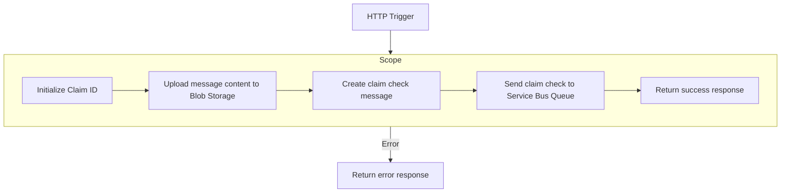
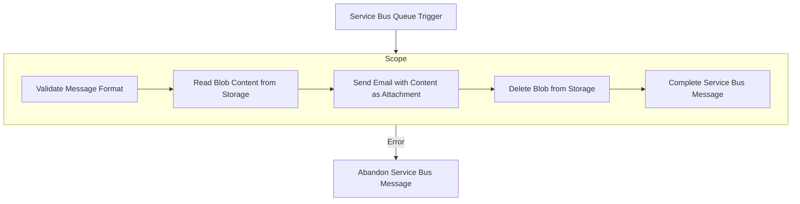

# Logic App Claim Check Pattern Implementation

This project implements the Claim Check Enterprise Integration Pattern using Azure Logic Apps Standard. The pattern helps manage large messages by storing the message content in a repository (Azure Blob Storage) and passing only a reference (claim check) between services via a message queue (Service Bus).

## Workflows

### 1. Claim Check Send

#### Title
Claim Check Pattern - Message Sender

#### Overview
This workflow implements the sender part of the Claim Check pattern. When a large message is received via HTTP request, it:
1. Generates a unique claim ID (a GUID)
2. Stores the message content in Azure Blob Storage using the claim ID as the blob name
3. Creates a small claim check message containing only metadata and the claim ID reference
4. Sends this small claim check message to a Service Bus queue
5. Returns an HTTP response indicating success or failure

This approach avoids Service Bus message size limits by storing the actual content in blob storage and passing only a reference.

#### Workflow Diagram

#### Connectors Required
- HTTP Trigger
- Azure Blob Storage
- Azure Service Bus

#### Parameters Used
- `claimRepository` - The name of the blob container where the message content is stored
- `claimcheckqueue` - The name of the Service Bus queue where claim check messages are sent

### 2. Claim Check Receive

#### Title
Claim Check Pattern - Message Receiver

#### Overview
This workflow implements the receiver part of the Claim Check pattern. It:
1. Listens for messages in a Service Bus queue using peek-lock mode
2. When a claim check message arrives, it validates the message format
3. Retrieves the original message content from Azure Blob Storage using the claim ID
4. Processes the retrieved content (in this case, by sending an email with the content as an attachment)
5. Deletes the blob from storage once processing is complete
6. Completes the Service Bus message to remove it from the queue

If any step fails, the Service Bus message is abandoned, allowing it to be retried later.

#### Workflow Diagram

#### Parameters Used
- `claimRepository` - The name of the blob container where the message content is stored
- `claimcheckqueue` - The name of the Service Bus queue where claim check messages are received from
- `destinationEmail` - The email address where processed messages are sent to

## Architecture Benefits

The Claim Check pattern provides several advantages:
- Avoids message size limitations in messaging systems
- Reduces the load on the messaging infrastructure
- Improves scalability and performance
- Decouples storage concerns from messaging concerns
- Enables secure handling of sensitive data
